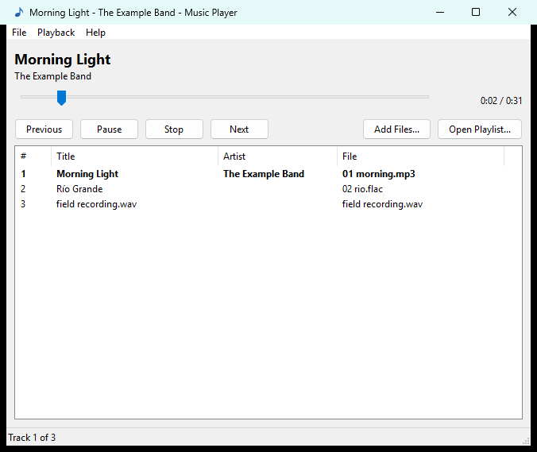

# Music Player

A small, standalone Windows music player. It runs next to World of Warcraft
(or anything else), without touching the game, and looks like a normal
Windows program on whatever version of Windows it runs on.

- Plays **MP3**, **FLAC** and **WAV** files.
- Shows the track's **title** and **artist** from the file's metadata. With
  no title in the metadata it shows the **file name**; with no artist, the
  artist line is left blank.
- A playlist with the **track number**, title, artist and file name. Click a
  column header to **sort** by it, and **drag** tracks (or use Move Up / Move
  Down) to put them in any order.
- **Play / Pause**, **Stop**, **Previous** and **Next**, plus a seek bar.
- Its own **volume** slider and **mute**, separate from the game's and
  Windows' volume.
- Opens **playlists** (`.m3u`, `.m3u8`, `.pls`) and saves them (`.m3u8`).
- Runs on **Windows XP SP3 through Windows 11**, 32-bit and 64-bit. A single
  `MusicPlayer.exe`, no installer, no DLLs, nothing written to the registry.

## Quick start

1. Download the latest zip from the
   [Releases](https://github.com/jeffcrone/WoW-Music-Player-Addon/releases) page.
   Use the **x86** build unless you specifically want 64-bit: it runs on
   every Windows version, 32- or 64-bit.
2. Unzip it anywhere and run `MusicPlayer.exe`.
3. **File > Open Files...** (Ctrl+O), or drag music files onto the window.

Details, keyboard shortcuts and troubleshooting: **[docs/RUNNING.md](docs/RUNNING.md)**.

## Documentation

| Document | What's in it |
| --- | --- |
| [docs/RUNNING.md](docs/RUNNING.md) | Using the player: opening files and playlists, controls, shortcuts, what is shown, troubleshooting. |
| [docs/BUILDING.md](docs/BUILDING.md) | Building from source with MSYS2 + MinGW-w64, step by step, including the Windows XP-compatible build. |
| [docs/TESTING.md](docs/TESTING.md) | Running the automated tests, what each suite covers, testing by hand, and testing on Windows XP. |

## How it is put together

| Path | What it is |
| --- | --- |
| `src/main.c` | The window: controls, menus, layout, file dialogs, drag and drop. |
| `src/player.c` | Playback through the Windows `waveOut` API, on a worker thread. |
| `src/volume.c` | The software volume: the slider-to-loudness curve and sample scaling. |
| `src/glyph.c` | Draws the Previous/Play/Pause/Stop/Next symbols, for the buttons and the Playback menu, at whatever size the window's scaling needs. |
| `src/decoder.c` | One interface over the MP3, FLAC and WAV decoders. |
| `src/tags.c` | Reads title and artist: ID3v2.2/2.3/2.4, ID3v1, FLAC Vorbis comments, WAV `LIST/INFO` and `id3 ` chunks. |
| `src/playlist.c` | The track list, Previous/Next logic, and M3U/M3U8/PLS reading and writing. |
| `src/track.c` | The display rules (title falls back to the file name, and so on). |
| `src/text.c` | Character-set conversion (UTF-8, UTF-16, Windows-1252). |
| `src/stream.c` | File access through plain Win32 calls. |
| `tests/` | The unit tests (`mp_tests`) and the Windows XP import checker (`xpcheck`). |
| `third_party/dr_libs/` | [dr_mp3, dr_flac and dr_wav](https://github.com/mackron/dr_libs) by David Reid: the audio decoders (public domain / MIT-0). |
| `Music_Icons/` | The app icon as SVG, PNGs (16 to 512 px) and a Windows `.ico`. |
| `tools/make_icons.py` | Regenerates everything in `Music_Icons/` from one definition. |
| `.github/workflows/` | CI: `tests.yml` (every push and pull request) and `release.yml` (see below). |

## Releasing

The version number lives in one place: the `project(MusicPlayer VERSION x.y.z)`
line at the top of `CMakeLists.txt`. To release, bump it and push to `main`.
The Release workflow builds both architectures and runs all the tests. Only
if everything passes does it create the `vX.Y.Z` tag and a GitHub release
with both zips attached. Pushes that don't change the version release
nothing. It can also be run by hand from the Actions tab.

## License

[MIT No Attribution](LICENSE). The bundled dr_libs decoders are public domain,
or MIT No Attribution where that is not recognized
([third_party/dr_libs/LICENSE](third_party/dr_libs/LICENSE)).
